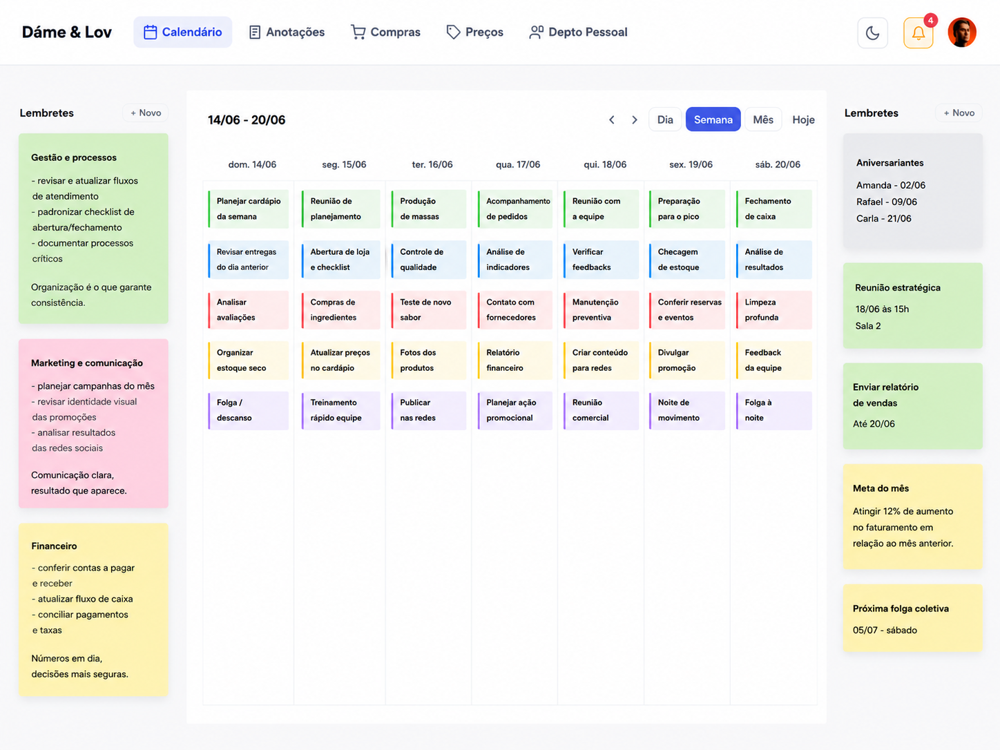

**How it was:** everything went through me, from admin work to operational decisions, with information scattered across different systems, spreadsheets, and folders.
**What I did:** I built an online portal, updated in real time and open to managers and the admin team, that brings calendar, purchasing, pricing, marketing, finance, and HR into one place, with an AI assistant that answers the team in my place. The data flows in on its own from my ordering system, iFood, the tax authority, and the site.
**Results:** better internal communication, fewer errors, and more leverage with suppliers. No fixed cost, no dependence on third-party systems, and fully customized.

***

An uncomfortable discovery: for a long time, **my company stopped whenever I didn't pick up the phone.** How much does this ingredient cost, how do you do that procedure, where's that piece of information, what do I reply to this customer. It all went through me. I was the help desk of my own operation.

There's a perverse pride in it at first, feeling that nothing moves without you. Then it becomes the ceiling. If everything depends on you being available, the business doesn't grow beyond your day.

## The mistake is thinking the fix is to answer faster

I didn't need to answer faster. I needed to **stop being the answer.**

The operation's information existed, it just lived in the worst possible place: in my head and in loose WhatsApp threads. When it lives there, only I can reach it, and only when I feel like it.

So I took it all out of me and put it in one place: a hub where the team runs the whole operation, in real time, instead of "text my phone".

## What became a single screen

*The whole operating week on one screen: the tabs up top, the gestão, marketing, and finance reminders down the sides.*

Each thing that used to live in a WhatsApp group, a notebook, or my memory became a tab:

- **Calendar and tasks.** What needs doing, by whom and when, without me remembering and chasing it in my head.
- **Purchasing.** What's missing and who to order from, with price history to negotiate better with the supplier.
- **Pricing.** Each item's price coming from the real cost, not a guess.
- **Marketing.** What goes out for each brand, agreed ahead, not in the rush of the day.
- **Finance.** Bills, cash flow, and the month's result in a single panel, fed by the real numbers.
- **HR.** Each person's payroll and file in one place, no stray spreadsheet.

And I'm not the one filling all of this in by hand. The data flows in on its own from my ordering system, iFood, the tax authority, and the site, in real time.

## The piece that got me out of the middle

What really freed me wasn't the task list. It was an **assistant that answers the team in the place where I used to answer.**

It's fed with the store's knowledge base, the way we do things, and it has a personality I define. When someone on the team has a question, they ask it, not me. It answers with the house standard, right away, at any hour.

> I wrote down "how it's done" once. From then on, the system is the one answering.

It's the same idea as [the Digital Cortex](/en/labs/segundo-cerebro-ia/), my external brain, but turned outward: instead of giving context to my AIs, it gives context to my team.

## Taking the owner out of the middle isn't losing control

The owner's fear is that if they step out of the middle, things fall apart. It's the opposite. **While the operation lives in your head, you don't have control, you have dependency.** Control is when the standard is written down, reachable, and being followed even with you gone.

Today the operation runs without me being the bottleneck. And my day, which used to be made of interruptions, became time to think about the business instead of just putting out its fires.

***

Taking the operation out of the owner's head and putting it somewhere the team and the AI can reach, without them losing control, is exactly the kind of project I help companies build.

**Stack:** a real-time intranet where the team runs calendar, purchasing, pricing, marketing, finance, and HR, with the data flowing in on its own from the ordering system, iFood, the tax authority, and the site, Google-account login and admin visibility over everything, plus an AI assistant that answers from a knowledge base and a persona the house configures itself.
